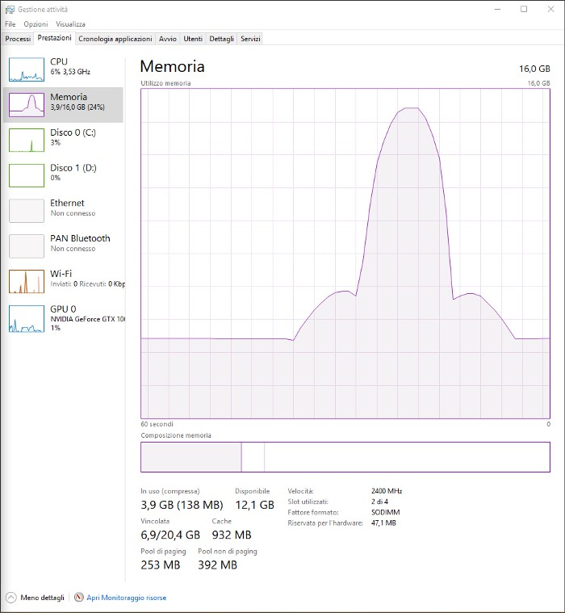

# TaskManager Function Plotter
A simple Function plotter for Windows Task Manager Memory chart. This is a project I made for fun several years ago.
It uses a memory pooling algorithm to fast allocate and deallocate huge amount of memory in order to plot a given real-valued function in the Task Manager memory chart.
It may be surprising what kind of functions you may be able to put in your task manager!



## Usage
Just compile and run. It only works on Windows, of course, but you may want to adapt to your own system configuration if you want. I suggest to use MSVC to compile this file.

## License
```
Copyright (c) 2018 helllayde

Permission is hereby granted, free of charge, to any person obtaining a copy
of this software and associated documentation files (the "Software"), to deal
in the Software without restriction, including without limitation the rights
to use, copy, modify, merge, publish, distribute, sublicense, and/or sell
copies of the Software, and to permit persons to whom the Software is
furnished to do so, subject to the following conditions:

The above copyright notice and this permission notice shall be included in all
copies or substantial portions of the Software.

THE SOFTWARE IS PROVIDED "AS IS", WITHOUT WARRANTY OF ANY KIND, EXPRESS OR
IMPLIED, INCLUDING BUT NOT LIMITED TO THE WARRANTIES OF MERCHANTABILITY,
FITNESS FOR A PARTICULAR PURPOSE AND NONINFRINGEMENT. IN NO EVENT SHALL THE
AUTHORS OR COPYRIGHT HOLDERS BE LIABLE FOR ANY CLAIM, DAMAGES OR OTHER
LIABILITY, WHETHER IN AN ACTION OF CONTRACT, TORT OR OTHERWISE, ARISING FROM,
OUT OF OR IN CONNECTION WITH THE SOFTWARE OR THE USE OR OTHER DEALINGS IN THE
SOFTWARE.
```
